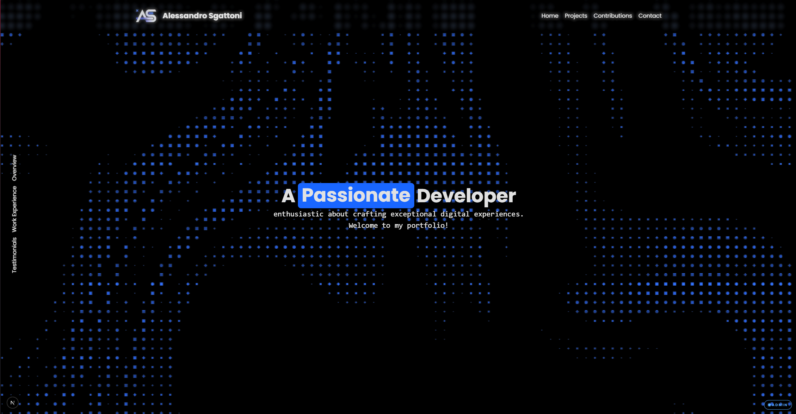

# Sgattix — Portfolio

My personal portfolio: a showcase of 40+ projects I've built (websites, Discord bots, Minecraft plugins, tools), with a live GitHub contribution graph and a built-in admin panel to manage it all without touching code.



### 👉 [Try it live: sgattix.online](https://sgattix.online/)

## Quick Start

```bash
git clone https://github.com/Sgattix/personal-portfolio.git && cd personal-portfolio
npm install
npm run dev
```

Then open http://localhost:3000. In development the admin panel at `/admin` accepts the password `admin`.

## Features

- **Landing page** with hero, overview, work experience, testimonials and an animated tech logo loop
- **Project showcase** (`/projects`) with search, category filters and sorting, plus a detail page per project with an image gallery and zoom
- **Contributions page** (`/contributions`) that renders my GitHub contribution calendar, including private contributions
- **Admin CMS** (`/admin`) to create, edit and delete projects, upload thumbnails and gallery images via drag & drop
- **Two storage backends**: local filesystem when self-hosted, Vercel Blob when deployed serverless
- **Hardened auth**: HMAC-signed session cookies, timing-safe password checks, fail-closed in production

## Local Setup

**Requirements:** Node.js 20+ and npm.

1. Copy the env template and fill it in:

   ```bash
   cp .env.local.example .env.local
   ```

   | Variable | Required | Purpose |
   | --- | --- | --- |
   | `ADMIN_PASSWORD` | In production | Password for `/admin` (defaults to `admin` in dev) |
   | `ADMIN_SECRET` | In production | Secret used to sign admin session cookies |
   | `BLOB_READ_WRITE_TOKEN` | No | Enables Vercel Blob storage; leave empty to use the local filesystem |
   | `GITHUB_TOKEN` | For `/contributions` | GitHub personal access token used to fetch the contribution graph |
   | `GITHUB_USERNAME` | For `/contributions` | Whose contributions to show |

2. Run it:

   ```bash
   npm run dev      # development server (Turbopack)
   npm test         # run the Vitest suite
   npm run build && npm start   # production build
   ```

## How It Works

- **Built with** Next.js 15 (App Router, Server Actions), React 19, TypeScript and Tailwind CSS 4. Animations use GSAP and Motion.
- **Project data** lives in [`src/app/config/projects.json`](src/app/config/projects.json), and images live in `public/assets/images/<project-id>/`. Public pages and the admin panel both read through [`src/lib/project-data.ts`](src/lib/project-data.ts).
- **Pluggable storage** ([`src/lib/storage.ts`](src/lib/storage.ts)): serverless platforms like Vercel have a read-only filesystem that resets on every deploy. So when `BLOB_READ_WRITE_TOKEN` is set, edits made in the admin panel are written to Vercel Blob as versioned JSON and the newest one is read back. Otherwise they go straight to disk. One codebase handles both self-hosted and serverless deploys.
- **Admin auth** ([`src/lib/admin-auth.ts`](src/lib/admin-auth.ts)) doesn't use a database or an auth library. A session is an expiring payload signed with HMAC-SHA256, stored in an HTTP-only cookie that lasts 8 hours. Passwords are compared with `timingSafeEqual` over hashes. If the env vars are missing in production, every login is refused, so there's no fallback anyone could exploit.
- **Contribution graph** ([`src/lib/github-contributions.ts`](src/lib/github-contributions.ts)) queries GitHub's GraphQL API on the server, so the token never reaches the browser.

## Credits

- [Next.js](https://nextjs.org/), [React](https://react.dev/), [Tailwind CSS](https://tailwindcss.com/)
- UI primitives from [Radix UI](https://www.radix-ui.com/) and [shadcn/ui](https://ui.shadcn.com/), plus components from [Kibo UI](https://www.kibo-ui.com/) (calendar, dropzone, image zoom)
- Animation: [GSAP](https://gsap.com/), [Motion](https://motion.dev/), [OGL](https://github.com/oframe/ogl)
- Icons: [Lucide](https://lucide.dev/) and [Tabler Icons](https://tabler.io/icons)
- Storage: [Vercel Blob](https://vercel.com/docs/storage/vercel-blob)
